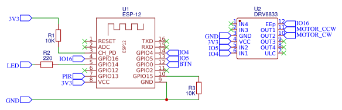

# ESP8266 Air Freshner

## Features

- Sprays automatically when 50 seconds of movement within 5 minutes window is detected
- Spray manually by pressing the button on the freshner
- Spray remotely with home assistant

## How to use it

You need to do the following to compile the firmware:

- Open the project with PlatformIO
- Modify `src/config.hpp` according to your setup
- Specify proper board and upload port in `platformio.ini`
- Build and upload the firmware to your board
- Connect to esp8266-XXXXXX wifi access point to configure device

## Example home-assistant configuration

```yaml
switch:
  - platform: mqtt
    name: Air Freshner
    icon: mdi:biohazard
    state_topic: esp8266/XXXXXX
    command_topic: esp8266/XXXXXX/set
```

## Scheme


